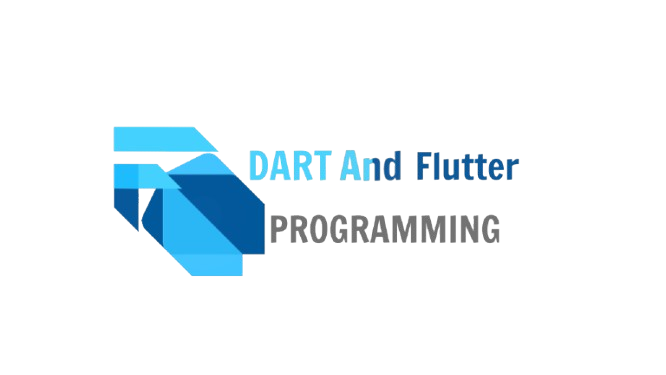

# 🚀 Hành Trình Chinh Phục Flutter & Dart

### **"Dart & Flutter - Từ Zero đến Hero"**

---

## 👋 Giới Thiệu

Chào mừng đến với repository học tập của tôi! Đây là nơi lưu trữ mã nguồn, ghi chú và những dự án thực hành được thực hiện trong quá trình tự học lập trình Mobile App bằng **Dart & Flutter**.

🎯 **Mục tiêu**: Nắm vững kiến thức từ cơ bản → nâng cao để có thể tự xây dựng và triển khai ứng dụng lên **Android & iOS**.

---

## 🗺️ Lộ Trình Học Tập (Roadmap)

Toàn bộ lộ trình được chia thành nhiều giai đoạn rõ ràng:

### **📌 Giai đoạn 1 — Dart Cơ Bản**

* [x] Installing Dart
* [x] Data Types
* [x] Dart Loops & Logic
* [x] Functions
* [x] User Input
* [x] Type Conversion (String ↔ Int)
* [x] OOP & Classes
* [x] Fizzbuzz Exercise

### **📌 Giai đoạn 2 — Flutter FPTU**

* [x] Lab 1 Hello Fluter 
<!-- * [ ] Widgets cơ bản: Container, Row, Column, Stack, ListView
* [ ] Stateful vs Stateless Widgets
* [ ] Forms & Input Handling
* [ ] Navigation (Navigator / GoRouter)
* [ ] Assets, Fonts & Images
* [ ] Responsive UI -->

<!-- ### **📌 Giai đoạn 3 — Logic & Data Handling** *(Upcoming)*

* [ ] Networking — REST API, HTTP, JSON
* [ ] Local Storage — SharedPrefs, SQLite/Drift, Hive
* [ ] State Management — Provider / Riverpod / BloC
* [ ] Firebase — Auth, Firestore, Cloud Functions

### **📌 Giai đoạn 4 — Advanced & Deploy** *(Upcoming)*

* [ ] Animation
* [ ] Clean Architecture
* [ ] Testing (Unit & Widget Test)
* [ ] CI/CD pipelines
* [ ] Deploy Play Store / App Store -->

---

<!-- ## 📱 Dự Án Thực Hành

| STT | Tên Dự Án               | Mô tả                                | Công nghệ             |  Preview        |
| --: | ----------------------- | ------------------------------------ | --------------------- | -------------- |
|  01 | Hello World App         | Làm quen widget cơ bản               | Dart + Flutter UI     | *comming soon* |
|  02 | Todo List App           | Quản lý công việc, CRUD LocalStorage | Flutter + Hive/SQLite | *comming soon* |
|  03 | Weather App *(dự kiến)* | Call API thời tiết realtime          | Flutter + HTTP API    | *updating*     | -->

---

<!-- ## 🛠️ Công Cụ Sử Dụng

| Danh mục        | Công cụ                  |
| --------------- | ------------------------ |
| IDE             | VS Code / Android Studio |
| UI Design       |                     |
| API Testing     |                   |
| Version Control | Git + GitHub             | -->

---

## 📚 Tài Liệu Học & Link Tham Khảo

| Tên tài liệu                  | Link                                                                                                                       |
| ----------------------------- | -------------------------------------------------------------------------------------------------------------------------- |
| Dart Language Tour            | [https://dart.dev/language](https://dart.dev/language)                                                                     |
| Flutter Course         | [UFlutter & Dart - The Complete Guide](https://www.udemy.com/course/learn-flutter-dart-to-build-ios-android-apps/?couponCode=2021PM25) - Được chia sẻ từ [Đỗ Trung Hiếu](https://www.facebook.com/kudoxH)|
| GeeksForGeeks Dart Tutorial   | [Dart Turtorial](https://www.geeksforgeeks.org/dart/dart-tutorial/)       |
| Youtube – Dart Course | [Codemy.com](https://youtu.be/JZukfxvc7Mc?si=dT-42VQ8lM85lib9) |

---

### ✨ Cảm ơn **GPT** vì đã tạo file README dùm tôi.

Hành trình vẫn còn dài — cố lên nào 💙🔥

